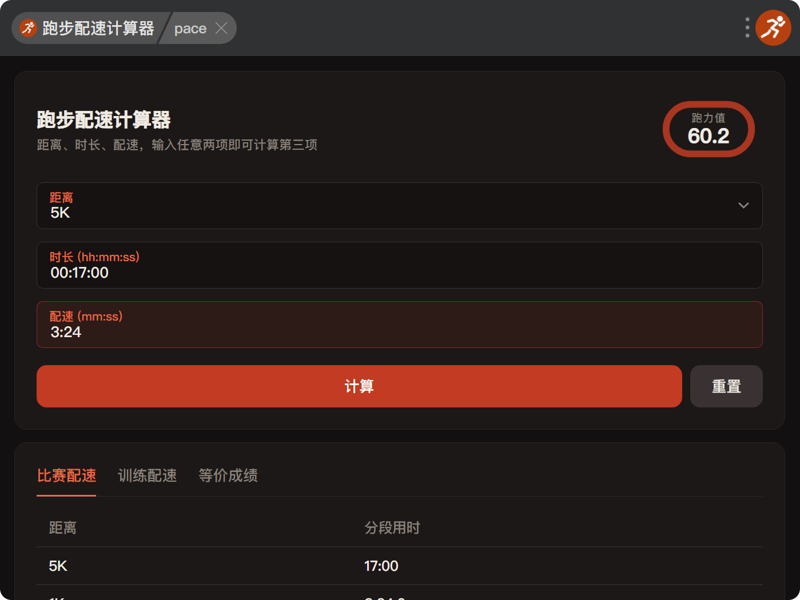

# 跑步配速计算器

一个基于 Jack Daniels VDOT 模型的跑步配速计算工具：距离、时长、配速三项输入任意两项即可算出第三项，并给出跑力值（VDOT）、训练配速与等价成绩预测。

## 使用说明

**打开方式**

- uTools：安装[插件](https://www.u-tools.cn/plugins/detail/%E8%B7%91%E6%AD%A5%E9%85%8D%E9%80%9F%E8%AE%A1%E7%AE%97%E5%99%A8/)后搜索「跑步配速计算器」，或通过关键词唤起：`pace`、`vdot`、`run`、`配速`、`跑步`、`马拉松`
- 浏览器：桌面或手机直接访问[网页版](https://z1130.github.io/uTools-pace_calculator/)，无需安装

**操作步骤**

1. 选择比赛项目（或输入自定义距离）
2. 填写时长或配速中的另一项
3. 点击「计算」，被求出的一项会高亮标出，同时生成跑力值与三个结果页签（比赛配速 / 训练配速 / 等价成绩）

## 截图

